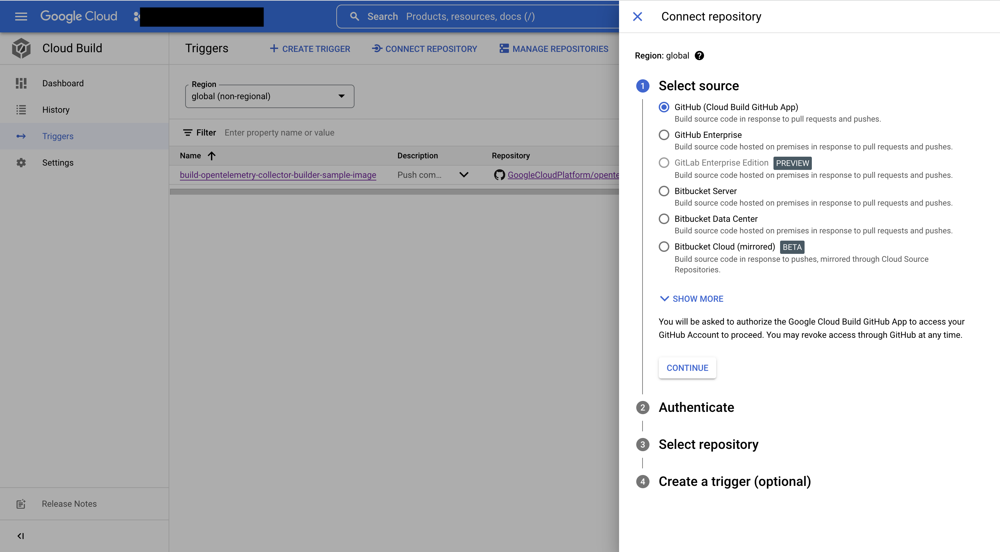

## Automated Builds with Cloud Build

This repo shows how you can leverage Google Cloud Build triggers to automate your custom collector builds based on certain events on GitHub (or other similar version control repository hosting service).

The steps shown here are meant to setup automation on this GitHub repository (GoogleCloudPlatform/opentelemetry-collector-builder-sample), but they can be adapted to work for your own repository which contains code for your custom Opentelemetry collector. The [terraform resources](/build/cloudbuild-automation/tf/) can be re-used for any repository with minimal change. 

Feel free to fork this repo directly or copy the files directly and modify them to suit your needs. 

After you have followed instructions in this README, you will have the following automation setup:
 - You will have an [Artifact Registry](https://cloud.google.com/artifact-registry) setup in your GCP project where all your custom opentelemetry collector docker images will be published. 
 - You will have your GitHub repository (containing the code to build your custom collector) linked with a [Cloud Build Trigger](https://cloud.google.com/build/docs/triggers) which will be configured to trigger an automated build for a collector image whenever there is a push to the `main` branch of the repository (*this can be updated to track any branch*).

### Prerequisites
- Make sure that you have [docker](https://docs.docker.com/engine/install/) installed on your machine.
    - Also verify that you are able to run docker commands without the need to gain root permissions using sudo. You can follow the [post-installation steps](https://docs.docker.com/engine/install/linux-postinstall/) to achieve this.
- Set the following environment variables 
    - `PROJECT_ID` with the GCP project ID in which you will submit cloud builds.
    - `GOOGLE_APPLICATION_CREDENTIALS` with the path to where your GCP credentials are present, most likely, it will be something like `${HOME}/.config/gcloud/application_default_credentials.json`.
    - You can set them by executing  
        ```bash
        export PROJECT_ID=<your-project-id>
        # This is where the default credentials live, might be different in case your default location is something else
        export GOOGLE_APPLICATION_CREDENTIALS=${HOME}/.config/gcloud/application_default_credentials.json
        ```

### Repository Structure - Cloudbuild-Automation

1. `tf/main.tf` - folder containing Terraform files that will create necessary resources in your GCP account. 
2. `tf/setup-build-automation.sh` - convenience shell script that runs the terraform script to generate the resources in GCP account. 
3. `builder-config.yaml` - configuration defining how to build the custom opentelemetry collector. 
4. `cloudbuild.yaml` - the YAML file containing steps that need to be run in cloud build. The cloudbuild trigger uses this file to build the docker image for the opentelemetry custom collector.

### Setting up the automation

1. Connect the GitHub repository for which you wish to setup the automated cloud builds with your GCP project. Look at [Connecting your repository to GCP account](#connecting-your-repository-to-gcp-account) section for the steps. 
2. Assuming you are in the root of the repository, move to the terraform folder containing the script - 
    ```
    cd build/cloudbuild-automation/tf
    ``` 
3. Modify the variables declared at the top in `setup-build-automation.sh` script to suit your needs. 
4. Run the `setup-build-automation.sh` script. 
    ```
    ./setup-build-automation.sh
    ```
5. Upon running the script, terraform will initialize and will generate a few files in the current directory.
6. After running the script successfuly and connecting your repository, you will have a Cloud Build trigger and an Artifact Registry configured for your selected project. You can verify this by looking these services in [Google Cloud Console](https://console.cloud.google.com).

Check your Google Cloud project console to verify that it now has the required resources - 
 - A Cloud Build Trigger configured to trigger on push to your repository
 - An Artifact Registry where the built collector images will be stored
you're done! They will already be configured to automatically build docker images of the collector whenever there is a `push` to the configured branch of your repository - You can test this by making a commit and pushing it. 

### Connecting your repository to GCP account

In order to run cloud builds on certain actions made against your repository, the repository needs to be connected to your project in Google Cloud. Since this step requires you logging into your GitHub account and authenticating a GitHub app *(Google Cloud Build)*, this steps needs to be done manually through Google Cloud console. 

For instructions, you can follow one of the below links:
 - [Connect to a GitHub repository](https://cloud.google.com/build/docs/automating-builds/github/connect-repo-github) - for connecting GitHub repos.
 - [Connecting to Repositories](https://cloud.google.com/build/docs/automating-builds/create-manage-triggers#connect_repo) - for connecting other source repositories. 

 **You should skip the last step - 'Create a Trigger', which is marked optional** - this is because
 further instructions in this readme will take care of both creating & configuring the build trigger. 

### Seeing the automation in action

Now that the automated builds are setup in your repository, you can view it in action by performaing the configured action on your repository. For instance, in this sample, we setup automated builds in response to a `push` on the `main` branch.   
 - Make a change (e.g. a simple change to your Readme) in your repository.
 - Commit the change
 - Push the change to your repository (you can either make a PR or `git push` directly). 

After making the push, you will see a triggered build in your [Cloud Build Console](https://console.cloud.google.com/cloud-build). 

After the build is successful, you will see a collector image built and placed in your configured artifact registry *(e.g. in this sample it is `otel-collectors`)*.

### Notes 
 - Whenever you make changes to the terraform file to modify/reconfigure the Google cloud resources, you will need to run the `setup-build-automation.sh` script again so that the changes can be put into effect. 
 - You only need to connect your repository to your GCP account once, unless you need to connect a new repository which was not connected before.

### Troubleshooting: Repository mapping does not exist 

If you skip connecting the repositories or the connection is not proper and continue with the remaining steps, you may end up with an error that looks something like - 
```bash 
Error: Error creating Trigger: googleapi: Error 400: Repository mapping does not exist. Please visit https://console.cloud.google.com/cloud-build/triggers/connect?project=<your-project-id> to connect a repository to your project
```
If this happens, you need to connect the correct repository to your GitHub account. Verify that the repository name and owner are correct and that its connected. 

After making sure that the names of repository and owner are correct, visit the URL in the error message. When you open the URL, it will take you to Google Cloud Console &rarr; Build Trigger page and a popup would be shown that looks similar to - 


The UI takes you through a series of simple prompts asking you to authenticate GitHub application and select which repositories to connect to the account. As a reminder, the selected repository & repository owner should match the one you define in `setup-build-automation.sh`. 

After connecting your repository, while still in `cloudbuild-automation/tf` directory, run - 
```bash
./setup-build-automation.sh
``` 
If the repository was connected successfully, the script will execute successfully with no issues. 

